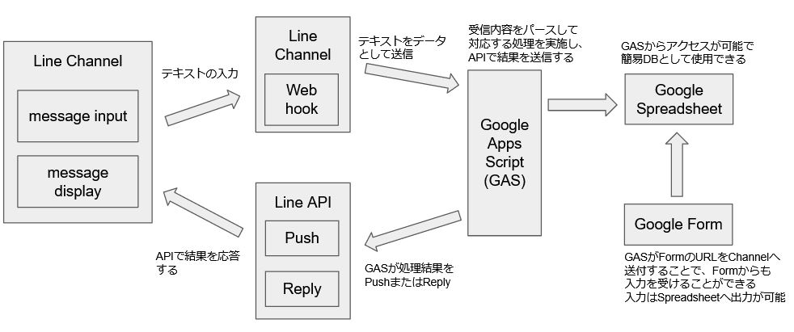

# GAS Serverless LINE API
LineBotをGASでサーバーレスで作るという記事を見て作成  
* 曜日表示、ゴミの日の表示、Todoリスト
* GoogleFormを利用したtodoの登録
* Claspの導入によるローカルでの作成方法
  
## 概要図


## 受付可能なコマンド
ヘルプ
```
指定したメッセージ(コマンド一覧)の表示
```
曜日？
```
今日の曜日を表示する
```
ゴミの日？
```
Spreadsheetに記載されている明日のゴミ分別を表示
```

リスト
```
現在のSpreadsheet上のTodoエントリの表示
```
入力？
```
Todoリストにエントリを書き込む為のフォームのリンクを表示する
```

検索？[word]
```
Todoリストの中身を指定wordで検索し、有無を返答する
```
  
## 環境

```
clasp login
clasp push
clasp logout #1
git add ./
git commit -m 
git push origin master
```
#1 不要かもしれない  
logoutするのは .clasprc.json をgitに上げないためだったが、  
gopathがdesktopに設定されているせいか、./ にはファイルが生成されない  
念のため.gitignoreに書いておけば要らないかもしれない  
  
## あとがき
* 試しながら作成したため、全体像が適当
* 一部入力にGoogleフォームを使用したが、CGIで簡素なフォームを表示するコードを直接書くのも手段としてある
　その場合は、入力内容のvalidationが必要になる
* しばらく別の開発で放置していたら応答不能になり再開に苦労した
　結局時間で復旧した。GASもlambdaのように実行前に暖気等が必要なのだろうか
